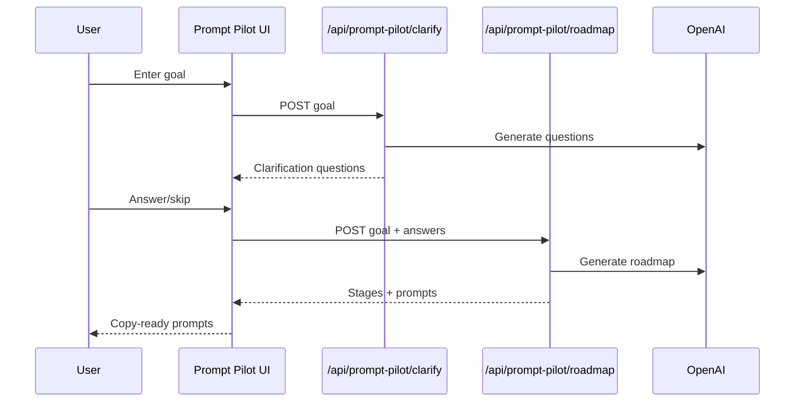

# Prompt Pilot (Day 6 of 30 Days of Product)

Prompt roadmap builder with clarifications and copy-ready steps.

## Live demo
- Visit https://lawrencehua.com/prompt-pilot

## Problem & Solution
- **Problem:** Users struggle to design multi-step prompts for complex goals.
- **Solution:** Collect a goal, auto-generate clarifying questions, then produce a staged prompt roadmap.

## What’s inside
- Standalone Next.js app with Prompt Pilot components, types, and AI service.
- APIs: `/clarify` and `/roadmap` hitting OpenAI; `.env.example` placeholders provided.

## Run locally
1. Install deps: `npm install`
2. Copy `.env.example` to `.env` and provide your values
3. Start dev server: `npm run dev`
4. Open `http://localhost:3000`

## Notes
- For demos, use the live link above.
- Repo name: Prompt Pilot (Day 6 of 30 Days of Product)

## Architecture
```mermaid
flowchart TD
  U[User] --> UI[Next.js Prompt Pilot UI]
  UI --> CMP[Prompt components]
  UI --> LIB[AI service]
  UI --> TYPES[Prompt types]
  UI --> Clarify[/api/prompt-pilot/clarify]
  UI --> Roadmap[/api/prompt-pilot/roadmap]
  Clarify --> OAI[OpenAI API]
  Roadmap --> OAI
```

## Sequence

